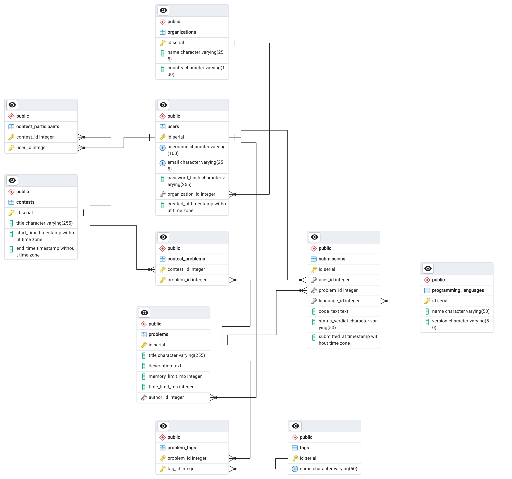

# Платформа для спортивного программирования

Веб-сервис для хранения задач по спортивному программированию, проведения соревнований и классификации алгоритмов.

## Схема Базы Данных (ERD)

## Анализ качества и безопастности кода 

Для проекта подключён [SonarCloud Dashboard](https://sonarcloud.io/summary/overall?id=KViahera_pre-graduate-practice&branch=main).

## Учет времени

| Задача | План (часы) | Факт (часы) |
| :--- | :--- | :--- |
| Шаг 1: Проектирование БД (PostgreSQL) | 4 | 2 |
| Шаг 2: JDBC консольное приложение | 4 | |
| Шаг 3: Backend на SpringBoot + Hibernate | 8 | |
| Шаг 4: Frontend | 16 | |
| Шаг 5: Запуск в Docker | 8 | |